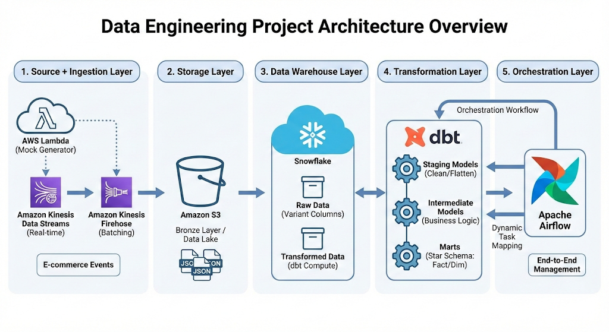
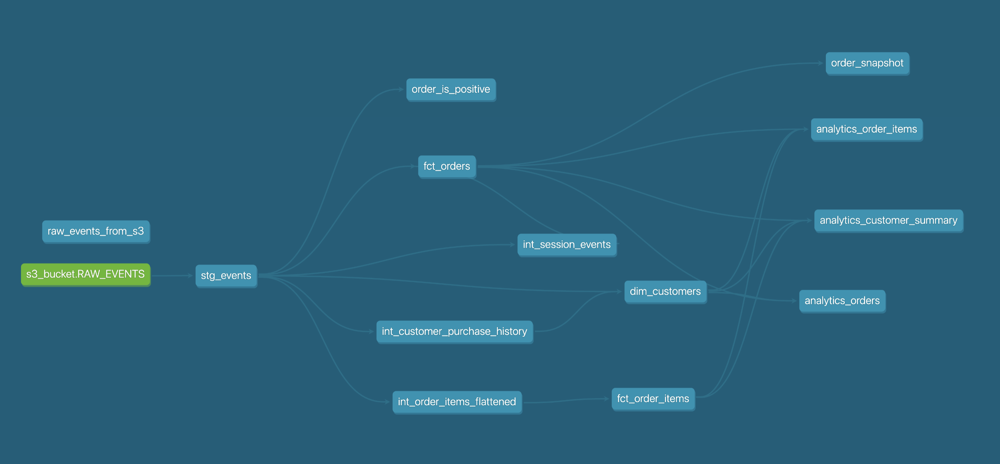
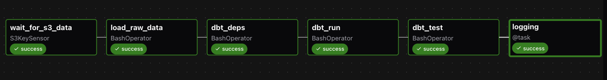
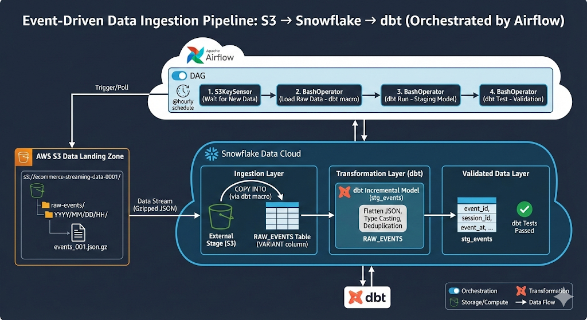
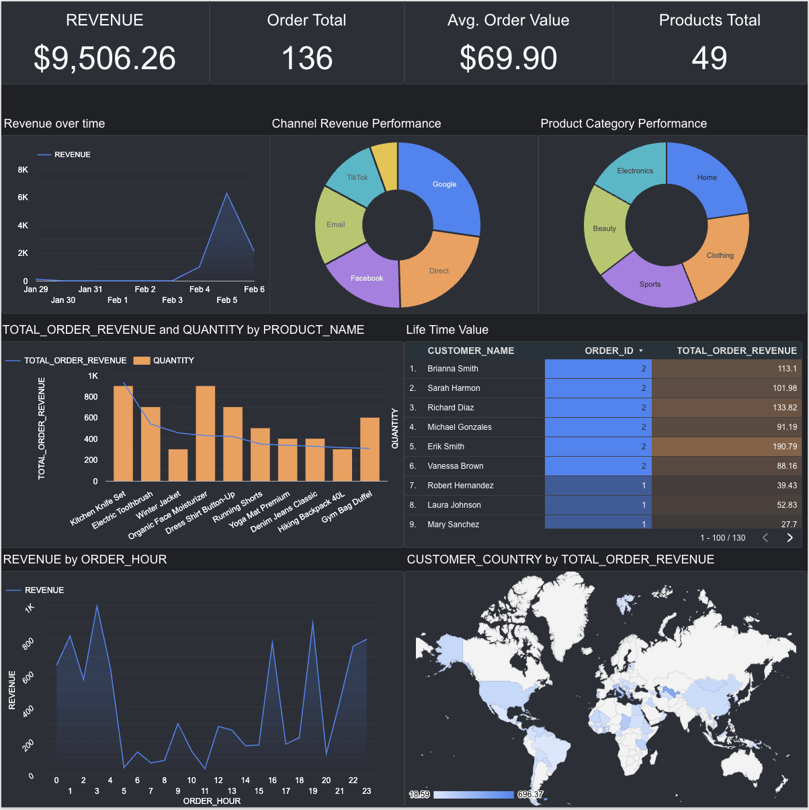

# E-commerce Analytics Pipeline


This project implements an **end-to-end real-time analytics pipeline** for e-commerce data, showcasing data engineering patterns. The pipeline ingests streaming events, transforms raw data into analytics-ready models, and powers business intelligence dashboards, orchestrated through Apache Airflow.

### Business Impact

**Problem Solved**: E-commerce teams need real-time visibility into revenue, customer behavior, and product performance to make data-driven decisions.

**Solution Delivered**:
- **Real-time insights** - Revenue and customer metrics updated hourly (vs. daily batch reports)
- **Cost efficiency** - Incremental processing reduces warehouse compute costs
- **Self-service analytics** - Pre-joined tables eliminate SQL knowledge barrier for business users
- **Data quality** - Automated testing catches data issues before they reach dashboards
- **Scalability** - Event-driven architecture handles data growth without code changes

**Business Outcomes**: Marketing can optimize campaigns in real-time, product teams identify top performers within hours, and executives track KPIs without waiting for analyst reports.

## Tech Stack

| Layer | Technology | Purpose |
|-------|-----------|---------|
| **Ingestion** | AWS Lambda, Kinesis, Firehose | Real-time event streaming |
| **Storage** | Amazon S3, Snowflake | Data lake + cloud warehouse |
| **Transformation** | dbt (data build tool) | SQL-based transformations |
| **Orchestration** | Apache Airflow (Astronomer) | Workflow automation |
| **BI** | Looker Studio | Analytics dashboards |

## Key Features

- **Event-Driven Architecture** - S3 sensors trigger pipelines automatically when new data arrives
- **Dynamic Task Mapping** - Airflow discovers and parallelizes dbt models at runtime
- **Star Schema Design** - Normalized marts + pre-joined analytics tables for BI tools
- **Data Quality Testing** - Automated dbt tests ensure data integrity
- **Incremental Processing** - Efficient transformations process only new/changed data
- **Secure Integration** - Keyless S3 → Snowflake authentication via IAM roles


## Architecture


### 1. Source + Ingestion Layer
Event data is generated using:
- **AWS Lambda**: Scheduled mock event generator mimicking an e-commerce platform.
- **Amazon Kinesis Data Streams**: Captures real-time event streams.
- **Amazon Kinesis Firehose**: Batches and delivers streams to S3.

### 2. Storage Layer
- **Amazon S3**: Acts as the "Bronze" layer / Data Lake, storing raw JSON event data.

### 3. Data Warehouse Layer
- **Snowflake**: Central data warehouse.
    - Loads raw JSON from S3 into variant columns.
    - Provides scalable compute for dbt transformations.

### 4. Transformation Layer
- **dbt (data build tool)**:
    - **Staging Models**: Clean, cast types, and flatten JSON data.
    - **Intermediate Models**: Apply business logic (e.g., sessionization, flatting order items).
    - **Marts**: Production-ready Fact and Dimension tables (Star Schema).



### 5. Orchestration Layer
- **Apache Airflow** (managed by Astronomer):
    - **Orchestration**: Manages the end-to-end workflow.
    - **Dynamic Task Mapping**: Automatically discovers dbt models (`dbt ls`) and maps them to Airflow tasks, allowing for scalable, parallel execution.
    


---

## Data Ingestion Pipeline

The pipeline automatically ingests data from S3 into Snowflake using an event-driven architecture. For complete technical details, see [data_ingestion.md](data_ingestion.md).



### S3 → Snowflake Loading Process

1. **S3 Landing Zone**: Events arrive as gzipped JSON files partitioned by date/hour

2. **Snowflake Storage Integration**: Secure, keyless authentication using IAM roles
   - External stage references S3 bucket
   - File format configured for JSON + GZIP
   - `RAW_EVENTS` table stores JSON in VARIANT columns

3. **dbt Macro Loading**: `copy_into_raw_events` macro executes `COPY INTO` command
   - Automatically maps JSON fields to columns
   - Skips files with errors (fault-tolerant)
   - Tracks source file lineage

4. **Airflow Orchestration**: Event-driven DAG triggers on new S3 data
   - `S3KeySensor` detects new files hourly
   - `BashOperator` executes dbt macro
   - Concurrency controlled via Snowflake connection pool

### Key Configuration

**Incremental Processing**: The staging model (`stg_events`) uses a 3-day lookback window to handle late-arriving events while processing only new data:

```sql
-- Processes new events + 3-day lookback for late arrivals
where event_data:event_timestamp::timestamp_ntz > (
    select dateadd('day', -3, coalesce(max(event_at), '1970-01-01')) 
    from {{ this }}
)
```

---

## dbt Transformation Layers

The dbt project follows a **medallion architecture** with four transformation layers. For detailed model documentation, see [dbt_flow.md](ecommerce-pipeline/README.md).

### Layer 1: Staging (`models/staging/`)

**`stg_events.sql`** - Parse raw JSON into typed columns
- **Materialization**: Incremental (merge on `event_id`)
- **Logic**: Flatten nested JSON, type casting, 3-day lookback for late arrivals
- **Output**: Clean, typed event records

### Layer 2: Intermediate (`models/intermediate/`)

Business logic transformations:

- **`int_customer_purchase_history.sql`** - Aggregate customer metrics (total orders, spend, last order)
- **`int_session_events.sql`** - Calculate session duration, event counts, conversion flags
- **`int_order_items_flattened.sql`** - Unnest JSON arrays using `LATERAL FLATTEN`

### Layer 3: Marts (`models/marts/`)

Star schema for data engineers:

- **`dim_customers.sql`** - Customer dimension (incremental)
- **`fct_orders.sql`** - Order facts (one row per order)
- **`fct_order_items.sql`** - Line item facts (one row per product per order)

### Layer 4: Analytics (`models/analytics/`)

Pre-joined, denormalized tables for BI tools (no joins required):

- **`analytics_orders.sql`** - Orders with customer + session context
- **`analytics_order_items.sql`** - Line items with full order + customer data
- **`analytics_customer_summary.sql`** - One-row-per-customer metrics with RFM scoring

### Data Flow Summary

```
Raw Events (S3) 
  → COPY INTO (Snowflake RAW_EVENTS)
  → Staging (parse JSON, type cast)
  → Intermediate (aggregate, flatten)
  → Marts (star schema)
  → Analytics (pre-joined for BI)
```

---

## Business Intelligence (BI) Layer

Below is a **Looker Studio dashboard** demonstrating downstream usage of the analytics tables:

**[View Live Dashboard](https://lookerstudio.google.com/reporting/688ca4fe-6786-418b-8c99-99368ca02972)**


